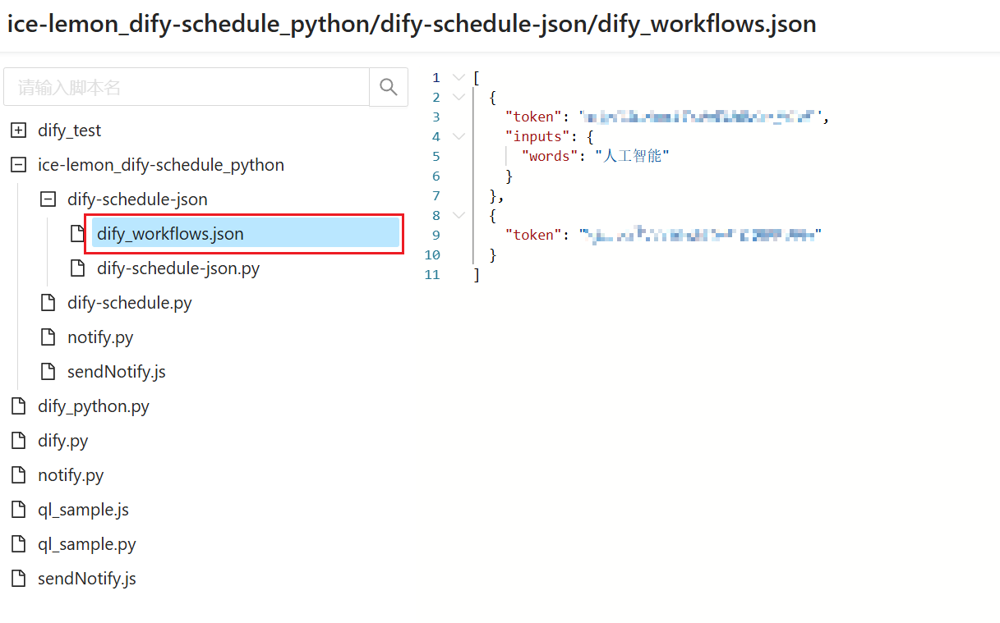

# Dify 定时工作流脚本

本脚本用于定时执行 Dify 工作流。与普通版本相比，本版本引入了**配置文件**来管理工作流的配置信息，包括 API Token 和工作流的输入参数，从而更加灵活和易于管理多个工作流。

## 主要更新

*   **配置文件驱动**:  工作流配置（Token, 输入参数）从环境变量 `DIFY_INPUTS` 和 `DIFY_TOKENS` 迁移到 JSON 配置文件 `dify_workflows.json` (默认)。
*   **支持多个工作流配置**:  配置文件中可以定义多个工作流，脚本会依次执行这些工作流。
*   **更灵活的入参配置**:  每个工作流可以在配置文件中定义不同的输入参数，不再局限于全局唯一的环境变量 `DIFY_INPUTS`。
*   **移除 `DIFY_TOKENS` 环境变量**:  不再需要单独设置 `DIFY_TOKENS` 环境变量，Token 信息直接在配置文件中指定。
*   **新增 `DIFY_WORKFLOW_CONFIG` 环境变量**:  用于自定义工作流配置文件的路径 (可选)。

## 使用方法

### 1. 配置文件准备

创建一个 JSON 文件，例如 `dify_workflows.json` (默认文件名)，用于配置你的 Dify 工作流。文件内容格式如下：

```json
[
  {
    "token": "YOUR_DIFY_TOKEN_FOR_WORKFLOW_1",
    "inputs": {
      "city": "北京",
      "webhook": "webhook_beijing_url"
    }
  },
  {
    "token": "YOUR_DIFY_TOKEN_FOR_WORKFLOW_1",
    "inputs": {
      "city": "上海",
      "webhook": "webhook_shanghai_url"
    }
  },
  {
    "token": "YOUR_DIFY_TOKEN_FOR_WORKFLOW_2",
    "inputs": {
      "product": "产品A",
      "region": "华东地区"
    }
  }
]
```
token: 必须配置。替换为你的 Dify 工作流 API Token。

inputs: 可选配置。一个 JSON 对象，定义了工作流的输入参数。参数名和参数值需要与你的 Dify 工作流定义一致。如果工作流不需要输入参数，可以省略 inputs 字段或设置为空对象 {}。
你可以根据需要配置多个工作流对象在 JSON 数组中。

提示：确保 JSON 格式正确，并且没有语法错误。
### 2. 环境变量配置 (可选)

*   **`DIFY_BASE_URL`**:  (可选)  Dify API 的基础 URL。默认为 `https://api.dify.ai/v1`。如果你的 Dify 服务部署在其他地址，请设置此环境变量。
*   **`DIFY_WORKFLOW_CONFIG`**: (可选)  工作流配置文件的路径。默认为 `dify_workflows.json`。如果你想使用其他文件名或路径的配置文件，请设置此环境变量。

   例如，在 Linux/macOS 中设置环境变量：

   ```bash
   export DIFY_BASE_URL=http://your-dify-api-url/v1
   export DIFY_WORKFLOW_CONFIG=/path/to/my_workflows_config.json
   ```

   在 Windows 中设置环境变量，请在 "系统属性" -> "高级" -> "环境变量" 中进行设置。

  青龙面板环境变量可以添加到 "环境变量" -> "创建环境变量"中。
### 青龙面板添加配置文件



新建默认配置文件`dify_workflows.json`添加到脚本所在目录下。
其余配置与标准脚本一致。
